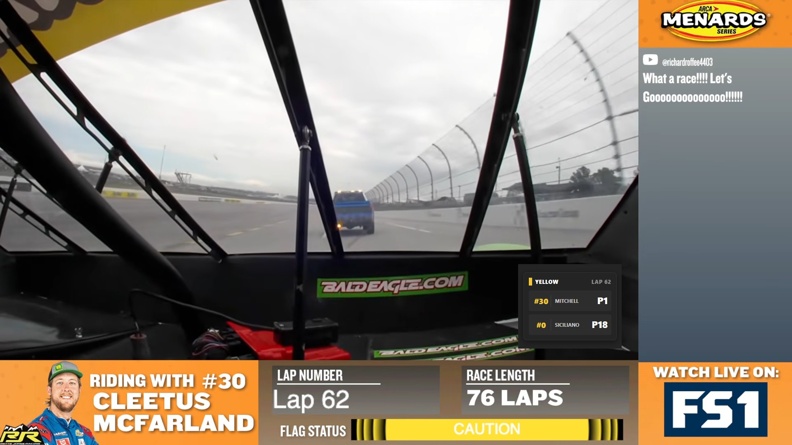

# Cleetus-Squirrel-Tracker 🏎️🐿️



A professional-grade, "always-on-top" desktop telemetry widget for tracking **Garrett Mitchell (Cleetus McFarland)** and **George Siciliano (Squirrel McNutt)** in real-time during ARCA Menards Series races.

Built for the community, this app provides a clean, broadcast-style overlay that pulls live telemetry directly from the ARCA/NASCAR digital data infrastructure.

## ✨ Features

- **Live Telemetry:** Real-time position tracking for Car #30 and Car #0.
- **Always-On-Top:** Standalone Electron window that stays pinned over your race stream.
- **Frameless UI:** A minimalist, semi-transparent design that looks like a native TV graphic.
- **Flag Status Indicator:** Interactive sidebar that changes color based on race conditions (Green, Yellow, Red, Checkered).
- **Auto-Update:** 5-second polling interval to ensure you're always synced with the lap count.
- **Draggable Interface:** Grab and move the widget anywhere on your screen with ease.

## 🛠️ Tech Stack

- **Framework:** [React](https://reactjs.org/) + [TypeScript](https://www.typescriptlang.org/)
- **Build Tool:** [Vite](https://vitejs.dev/)
- **Desktop Wrapper:** [Electron](https://www.electronjs.org/)
- **Data Source:** NASCAR/ARCA Live Timing API (`cf.nascar.com`)

## 🚀 Getting Started

### Option 1: Standalone Widget (Easiest)
A pre-built, portable `.exe` version is included in this repository for immediate use. 
1.  **[Download CleetusWatch.exe](https://github.com/robgilm/Cleetus-Squirrel-Tracker/raw/master/release/CleetusWatch.exe)**
2.  Launch the app—it will appear as a pinned, "always-on-top" box on your screen.
3.  *Note: You may need to click "More Info" -> "Run Anyway" on Windows since the app is not signed.*

### Option 2: Build from Source
If you want to build the portable desktop app yourself:
1.  Install dependencies: `npm install`
2.  Build the EXE: `npm run dist`
3.  Your custom build will be in the `release` folder.

### Option 3: Development Mode
If you want to run the app in a browser or live-reload environment:
1.  **Clone the repository:**
   ```bash
   git clone https://github.com/robgilm/Cleetus-Squirrel-Tracker.git
   cd Cleetus-Squirrel-Tracker
   ```

2.  **Install dependencies:**
   ```bash
   npm install
   ```

3.  **Run the application:**
   ```bash
   # Start the Vite development server (handles API proxy)
   npm run dev
   
   # In a new terminal, launch the Electron widget
   npm run electron
   ```

## 🤝 Credits
This project was autonomously designed and implemented by **Gemini CLI**, an interactive AI engineering agent.

## ⚖️ License & Disclaimer
This project is an unofficial fan-made tool and is not affiliated with, endorsed by, or associated with ARCA, NASCAR, Rette Jones Racing, or any official racing body.

---
*Hell Yeah Brother!* 🏁
